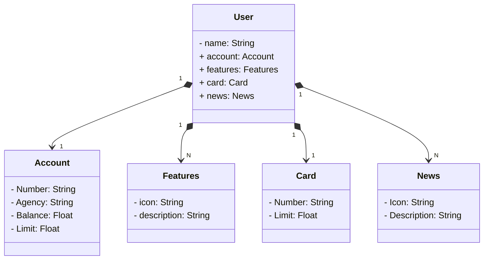

# Santander Dev Week 2023
Java RESTFul API criada para a Santander Dev Week

## Diagrama de classes

```mermaid
classDiagram
    class User {
        - name: String
        + account: Account
        + features: Features
        + card: Card
        + news: News
    }

    class Account {
        - Number: String
        - Agency: String
        - Balance: Float
        - Limit: Float
    }

    class Features {
        - icon: String
        - description: String
    }

    class Card {
        - Number: String
        - Limit: Float
    }

    class News {
        - Icon: String
        - Description: String
    }

    User "1" *--> "1"  Account
    User "1" *--> "N" Features
    User "1" *--> "1" Card
    User "1" *--> "N" News
```
